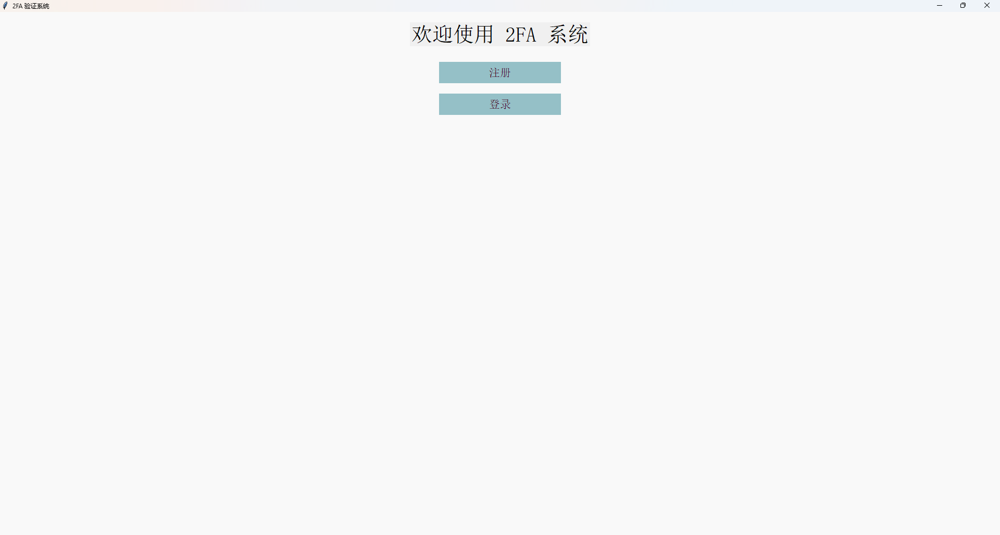
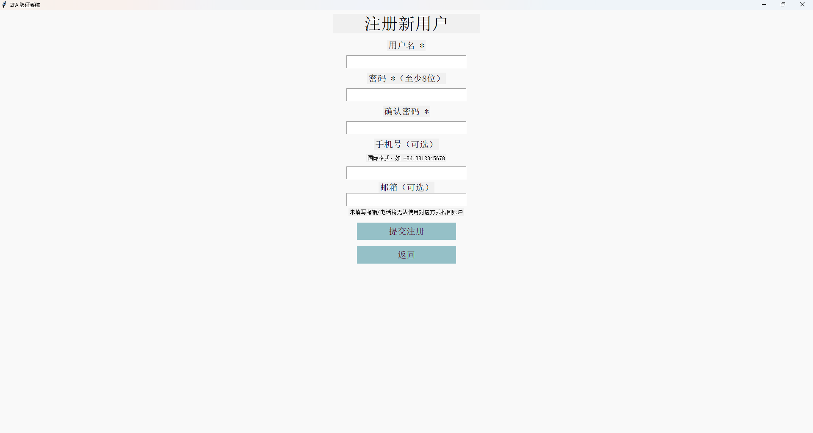
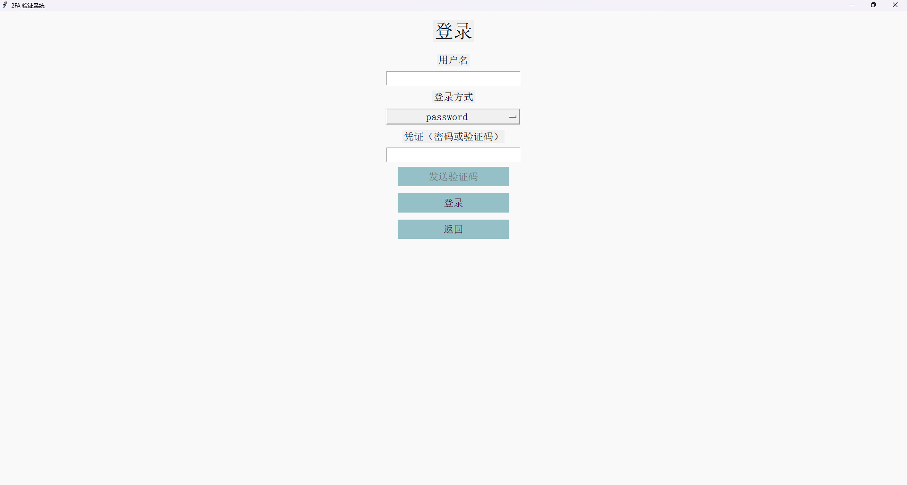
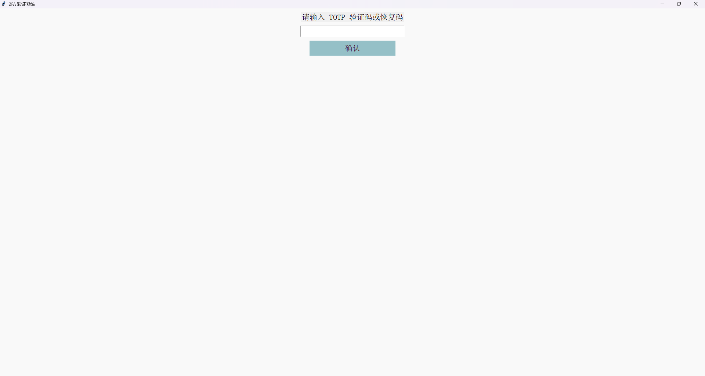

# 2FA-auth-login-sys
一个简洁的带 2FA 双因认证的注册-登录系统
## 使用方法
将所有文件打包到同一目录下，在目录下打开 powershell / cmd，运行：
```
python main.py
```
## 可能出现的问题
- 如果使用的 python 版本大于 3.12 可能会出现类似下方的报错：
```
_tkinter.TclError: Can't find a usable init.tcl in the following directories:
D:/python3.13/lib/tcl8.6 D:/py_ff/.venv/lib/tcl8.6 D:/py_ff/lib/tcl8.6 D:/py_ff/.venv/library D:/py_ff/library D:/py_ff/tcl8.6.14/library D:/tcl8.6.14/library

This probably means that Tcl wasn't installed properly.
```
- 解决方法：
  1. 使用 <=3.12 版本的 python
  2. 自行将所需的 init.tcl 文件放入报错提示中提及的任一目录下
# 界面展示




